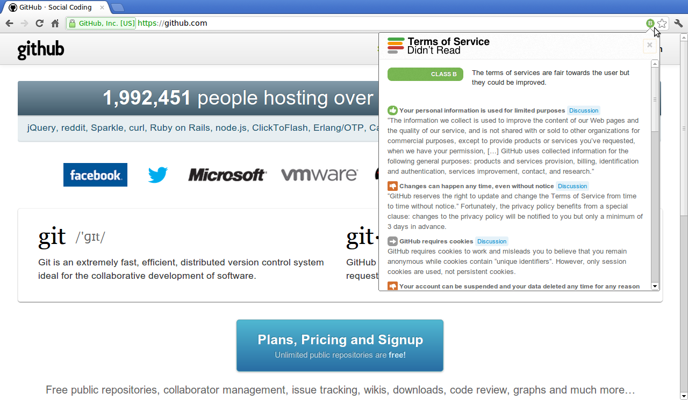

# Chrome extension for [Terms of Service; Didn't Read][tosdr]

“I have read and agree to the Terms” is the biggest lie on the web.
We aim to fix that. “Terms of Service; Didn't Read” is a user
rights initiative to rate and label website terms & privacy
policies, from very good (class A) to very bad (class E).

This extension informs you instantly of your rights online by
showing an unintrusive icon in the toolbar. You can click on this
icon to get summaries from the [Terms of Service; Didn't
Read][tosdr] initiative. Additionally, the extension will warn you
when you visit for the first time a website with a bad rating.

Get the extension [here](https://chrome.google.com/webstore/detail/terms-of-service-didn%E2%80%99t-r/hjdoplcnndgiblooccencgcggcoihigg)

[tosdr]: http://tosdr.org

Screenshots
=========

------------

The extension is Free Software, licensed under the GNU Affero
General Public License (AGPL-3.0). You can report bugs and
contribute features at <https://github.com/tosdr/tosdr-chrome>.
If you like it, please consider
[contributing](http://tosdr.org/contribute.html) to the project.
